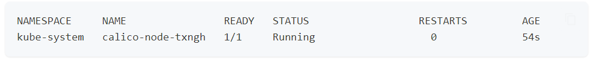

# install-calico-kubernetes
How to install calico on kubernetes multimaster

## calico
Calico adalah salah satu solusi jaringan yang sering digunakan dalam lingkungan Kubernetes. Ini adalah proyek open-source yang dirancang khusus untuk menyediakan keamanan, kebijakan, dan routing jaringan di dalam cluster Kubernetes. Calico memungkinkan komunikasi yang aman antar container dan pod, serta memberikan kontrol terhadap lalu lintas jaringan di seluruh cluster.

Beberapa fitur utama Calico di lingkungan Kubernetes meliputi:

Routing: Calico menggunakan protokol BGP (Border Gateway Protocol) untuk mengelola routing di dalam cluster Kubernetes. Ini memungkinkan komunikasi yang efisien antar pod di seluruh node dalam cluster.

Keamanan dan Kebijakan: Calico mendukung kebijakan jaringan yang kaya untuk mengontrol lalu lintas antar pod. Anda dapat menentukan kebijakan akses yang sangat terperinci, memungkinkan atau memblokir lalu lintas berdasarkan alamat IP, port, protokol, dan label pod.

Network Address Translation (NAT): Calico mendukung NAT untuk menyembunyikan alamat IP pod dari luar cluster, meningkatkan keamanan dan privasi.

Integrasi dengan Kubernetes Network Policies: Calico dapat berintegrasi dengan kebijakan jaringan bawaan Kubernetes untuk memberikan kontrol tambahan terhadap lalu lintas jaringan.

Monitoring dan Logging: Calico menyediakan alat monitoring dan logging yang memungkinkan Anda untuk melacak lalu lintas jaringan, mendeteksi potensi ancaman keamanan, dan menganalisis kinerja jaringan.

Dengan menggunakan Calico, administrator Kubernetes dapat mengelola dan mengamankan lalu lintas jaringan dengan lebih efektif di dalam cluster yang telah dibangun.

## Install the operator on your cluster and download manifest (do only in one master)
```bash
mkdir calico
cd calico
wget https://raw.githubusercontent.com/projectcalico/calico/v3.26.4/manifests/custom-resources.yaml
kubectl create -f tigera-operator.yaml
```
## Download the custom resources necessary to configure Calico

```bash
wget https://raw.githubusercontent.com/projectcalico/calico/v3.26.4/manifests/custom-resources.yaml
```
change block cidr base on your cluster init</br>
```bash
apiVersion: operator.tigera.io/v1
kind: Installation
metadata:
  name: default
spec:
  # Configures Calico networking.
  calicoNetwork:
    # Note: The ipPools section cannot be modified post-install.
    ipPools:
    - blockSize: 26
      cidr: 172.16.0.0/16
      encapsulation: VXLANCrossSubnet
      natOutgoing: Enabled
      nodeSelector: all()

---

# This section configures the Calico API server.
# For more information, see: https://projectcalico.docs.tigera.io/master/reference/installation/api#operator.tigera.io/v1.APIServer
apiVersion: operator.tigera.io/v1
kind: APIServer
metadata:
  name: default
spec: {}

```
## apply custome resource
```bash
kubectl create -f custom-resources.yaml
```

## check running pods on namespace calico-system 
```bash
watch kubectl get pods -n calico-system
```
result </br>


## 🔗 About me
[](https://www.linkedin.com/in/falyan-zuril-587585247/)
